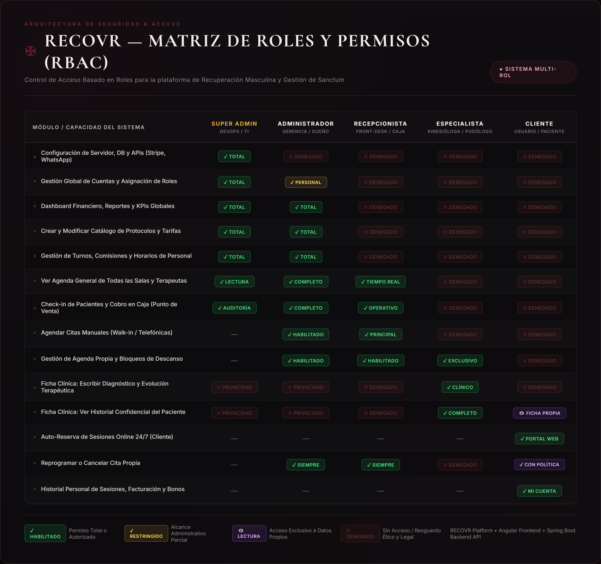

# RECOVR — Matriz y Especificación de Roles del Sistema (RBAC)

Este documento define la arquitectura de **Control de Acceso Basado en Roles (RBAC - Role-Based Access Control)** para el sistema web de **RECOVR (Spa de Recuperación Masculina)**.

---

## 1. Definición de Roles del Sistema

### 1. Rol Super Admin / DevOps (Soporte TI y Seguridad)
* **Perfil:** Administrador técnico de sistemas e infraestructura.
* **Propósito:** Garantizar la disponibilidad, seguridad, escalabilidad e integraciones técnicas de la plataforma.
* **Módulos y Capacidades:**
  - **Infraestructura y Base de Datos:** Backups automatizados, migraciones de base de datos y control de accesos a nivel de servidor.
  - **Integraciones y APIs:** Pasarelas de pago (Stripe, Transbank, Webpay), API oficial de WhatsApp para recordatorios automatizados y servicios de correo transaccional.
  - **Gestión Global de Usuarios:** Asignación de roles y permisos del sistema.
  - **Logs de Auditoría y Seguridad:** Trazabilidad de accesos, monitoreo de errores y seguridad de sesiones.

---

### 2. Rol Administrador (Gerente / Dueño del Spa)
* **Perfil:** Dueño del negocio o administrador general.
* **Propósito:** Control estratégico, financiero y operativo total de la plataforma.
* **Módulos y Capacidades:**
  - **Dashboard Financiero y KPIs:** Visualización de ingresos brutos/netos, tasa de ocupación de salas, servicios más rentables y tasa de cancelación.
  - **Gestión de Personal:** Altas/bajas de kinesiólogas, podólogos y recepcionistas; asignación de turnos base y cálculo de comisiones.
  - **Gestión de Catálogo y Tarifas:** Creación y modificación de protocolos, precios, duraciones y promociones/paquetes.
  - **Gestión de Infraestructura:** Configuración de cabinas/salas (ej. Sanctum 01, Sala de Podología Clínica).
  - **Control Operativo:** Supervisión de todas las reservas y clientes del spa.

---

### 3. Rol Recepcionista (Front-Desk / Atención al Cliente)
* **Perfil:** Personal de recepción física y atención telefónica/canales digitales.
* **Propósito:** Operación diaria del spa en tiempo real, agilidad en caja y recepción del cliente.
* **Módulos y Capacidades:**
  - **Agenda General en Tiempo Real:** Vista interactiva tipo calendario de todas las salas y profesionales del día.
  - **Check-in y Check-out:** Marcación de estados ("Cliente en espera", "En sesión", "Finalizado").
  - **Reserva Manual (Walk-in / Teléfono):** Capacidad de agendar citas para clientes que llegan directamente o llaman sin usar la web.
  - **Punto de Venta / Caja Chica:** Registro de pagos (efectivo, tarjeta, transferencia), generación de comprobantes y cierre de caja diario.
  - **Gestión de Imprevistos:** Reasignación rápida de profesional o sala en caso de contingencia.

---

### 4. Rol Especialista / Terapeuta (Kinesióloga / Masoterapeuta / Podólogo Clínico)
* **Perfil:** Profesionales de la salud y el bienestar encargados de ejecutar los tratamientos.
* **Propósito:** Ejecución del protocolo terapéutico, confidencialidad clínica y gestión de su tiempo de atención.
* **Módulos y Capacidades:**
  - **Agenda Personal:** Vista exclusiva de sus turnos asignados del día y semana (sin acceso a datos financieros globales).
  - **Ficha Clínica y Evolución:** Acceso y registro del historial terapéutico del cliente (ej. contracturas lumbares, tratamiento de callosidades, lesiones deportivas, alergias a aceites o nivel de presión preferido).
  - **Control de Sesión:** Marcación de inicio y término de sesión.
  - **Gestión de Disponibilidad:** Solicitud o bloqueo de descansos, colaciones o permisos especiales.

---

### 5. Rol Cliente (Usuario Final / Paciente)
* **Perfil:** Cliente masculino que contrata servicios de recuperación física o podología.
* **Propósito:** Auto-gestión de reservas, pagos y seguimiento de su bienestar personal.
* **Módulos y Capacidades:**
  - **Navegación y Catálogo:** Exploración de servicios con descripciones, precios, duración y profesionales calificados.
  - **Flujo de Auto-Reserva 24/7:** Selección guiada de servicio $\rightarrow$ especialista $\rightarrow$ fecha y hora $\rightarrow$ confirmación.
  - **Portal del Cliente ("Mi Cuenta"):**
    - Historial de sesiones realizadas.
    - Citas futuras (con opción de reprogramación o cancelación según las políticas del spa).
    - Preferencias personales (música, intensidad de masaje, zonas a evitar).
    - Gestión de membresías, bonos o créditos activos.

---

## 2. Matriz de Permisos del Sistema (RBAC)

> **Archivo de imagen generado en alta resolución (ideal para diapositivas):** [matriz_roles_recovr.png](file:///c:/Users/mharb/Downloads/RECOVR-feature-02-dashboard-ui/exposicion/matriz_roles_recovr.png)

| Módulo / Acción | Super Admin | Administrador | Recepcionista | Especialista | Cliente |
|---|:---:|:---:|:---:|:---:|:---:|
| Configuración de servidor, DB y APIs externas | ✅ | ❌ | ❌ | ❌ | ❌ |
| Gestión global de roles y cuentas del sistema | ✅ | ✅ *(Personal)* | ❌ | ❌ | ❌ |
| Ver métricas financieras y KPIs del spa | ✅ | ✅ | ❌ | ❌ | ❌ |
| Crear / editar servicios, protocolos y precios | ✅ | ✅ | ❌ | ❌ | ❌ |
| Administrar turnos, horarios y comisiones | ✅ | ✅ | ❌ | ❌ | ❌ |
| Ver agenda general de todas las salas/cabinas | ✅ | ✅ | ✅ | ❌ | ❌ |
| Check-in de clientes y cobro en caja | ✅ | ✅ | ✅ | ❌ | ❌ |
| Agendar citas manuales (Walk-in / Teléfono) | ✅ | ✅ | ✅ | ❌ | ❌ |
| Ver agenda propia de trabajo | ➖ | ✅ | ✅ | ✅ | ❌ |
| Escribir en Ficha Clínica terapéutica | ❌ | ❌ *(Privacidad)* | ❌ | ✅ | ❌ |
| Ver Ficha Clínica completa del paciente | ❌ | ❌ *(Privacidad)* | ❌ | ✅ | 👁️ *(Solo lectura propia)* |
| Reservar cita online (auto-servicio 24/7) | ❌ | ❌ | ❌ | ❌ | ✅ |
| Reprogramar / Cancelar cita propia | ✅ | ✅ | ✅ | ❌ | ✅ *(según política)* |
| Ver historial personal de sesiones y notas | ❌ | ❌ | ❌ | ❌ | ✅ |
